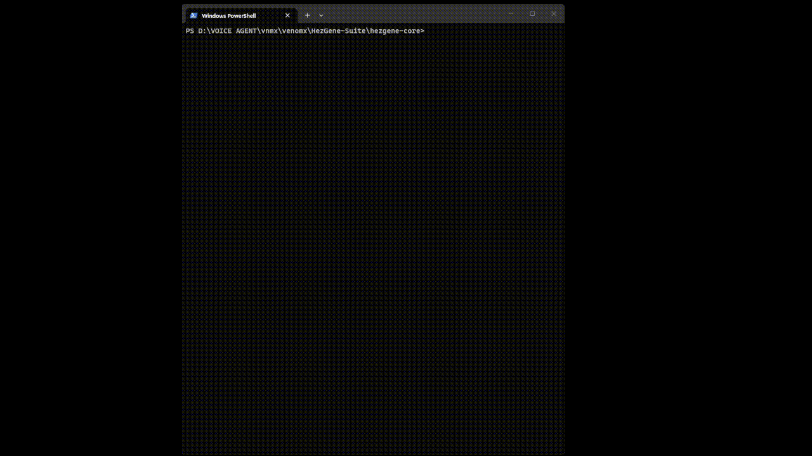

# 🧬 HezGene — The DNA of Software

<!-- Badge Bar -->
[](https://pypi.org/project/hezgene/)
[](https://pypi.org/project/hezgene/)
[](LICENSE)
[](https://github.com/TechVenom/HezGene)



*Watch a function evolve from 18 slow lines to 6 optimized lines in 30 seconds — 52% faster, 67% less code.*

## Title + One-Liner

Type `hezgene run` in your terminal and it evolves your Python code — spawning mutants, testing them in an arena, and saving the winner safely. Your code gets faster, cleaner, and more robust without you touching it.

---

## 🔥 Why HezGene Exists

Software rots. Bugs accumulate. Technical debt kills projects. Humans are terrible at maintaining complex systems over time. Every refactor risks breaking things.

**The radical idea:** What if code wasn't written by humans and then frozen? What if it was **alive**?

HezGene is the first autonomous genetic software evolution platform. Every function has DNA — performance metrics, bug history, complexity scores. HezGene spawns mutant versions, tests them in an arena, and deploys the winner automatically. Your code gets better **without you touching it**.

> *"This is our Bitcoin moment. We're not building another app — we're creating a new way software exists."*

---

## Quick Start (Three Commands)

```bash
pip install hezgene
hezgene init
hezgene run src/
```

That’s it. Your functions now have mutants competing. (By default, winners are written to `.hezgene/sandbox/` — add `--apply` when you want to deploy changes to your source files.)

## What You Get

```
.hezgene/
├── sandbox/           # evolved code (safe — originals untouched)
├── backups/           # automatic backups before every deployment
├── dna_registry.json  # genetic profiles of every function
└── history.json       # evolution event timeline
```

## Prerequisites Table

| Requirement | Minimum | Check | Install |
|-------------|---------|-------|---------|
| Python | 3.10+ | `python --version` | https://python.org |
| LLM (optional) | Ollama or API key | `ollama list` | https://ollama.com |

## Installation (Multiple Methods)

```bash
# Recommended (if you use uv)
uv tool install hezgene

# Alternatives
pipx install hezgene
pip install hezgene
```

Not currently distributed via Homebrew or winget in this repository. If you maintain a formula/package, PRs are welcome.

## Quick Demo

```bash
hezgene-demo
```

A short terminal walkthrough: original slow code → DNA extracted → mutants spawned → arena fight → winner announced → sandbox output → verification.

## Core Workflow (5 Steps)

1. **Extract** — Every function gets DNA (speed, memory, complexity, bugs)
2. **Mutate** — AST strategies + optional LLM mutations
3. **Evaluate** — 5-Ring Fitness Gauntlet (correctness, speed, memory, edge cases, readability)
4. **Select** — Tournament manager picks the winner
5. **Deploy** — Winner replaces original with backup + rollback safety (only with `--apply`)

## Common Commands (80/20)

```bash
hezgene init                          # Initialize in a project
hezgene run src/utils.py              # Evolve a file (sandbox mode)
hezgene run src/utils.py:func         # Evolve a specific function
hezgene run --target slowest          # Auto-find and evolve worst function
hezgene run src/ --llm                # Include AI-powered mutations
hezgene run src/utils.py --apply      # Deploy directly (not just sandbox)
hezgene verify                        # Confirm evolved code matches original
hezgene dna src/utils.py:func         # Show function DNA profile
hezgene log                           # View evolution history
hezgene freeze src/auth.py:verify     # Protect critical functions
```

## LLM Configuration

```bash
# Ollama (local)
hezgene config --set llm.provider ollama
hezgene config --set llm.model gemma2:2b

# OpenAI-compatible
hezgene config --set llm.provider openai
hezgene config --set llm.model gpt-4o-mini

# Anthropic
hezgene config --set llm.provider anthropic
hezgene config --set llm.model claude-sonnet-4-20250514

# Gemini
hezgene config --set llm.provider gemini
hezgene config --set llm.model gemini-2.5-flash

# VENOMX
hezgene config --set llm.provider venomx
hezgene config --set llm.model default
```

## What HezGene Handles

| Type | What | Notes |
|------|------|-------|
| Standalone functions | Evolved | Functions with >2 lines |
| Class methods | Evolved | Dunder methods are skipped |
| Very short functions | Skipped | “Too short to optimize” |
| Imports / module-level statements | Skipped | Never modified directly |

## Safety Features

- **Sandbox by default** — `hezgene run` never touches original files unless `--apply` is used
- **Correctness verification** — Every mutant must produce identical outputs
- **Automatic backups** — Timestamped backup before every deployment
- **Rollback** — `hezgene rollback <file.py>` restores the most recent backup
- **Freeze protection** — Critical functions locked from evolution
- **Minimum improvement threshold** — Only meaningful improvements are deployed

## Web Dashboard

```bash
hezgene ui
```

Launches the dashboard at `http://127.0.0.1:8000`. Use `--port` to change the port:

```bash
hezgene ui --port 8080
```

## CI/CD Integration

GitHub Actions:

```bash
hezgene ci --github
```

GitLab CI:

```bash
hezgene ci --gitlab
```

## Privacy

- **AST mutations** — Processed locally. Nothing leaves your machine.
- **LLM mutations** — Only sent to your configured LLM provider when `--llm` is used.
- **No telemetry** — No usage tracking. No analytics. No phone home.

## Troubleshooting

| Problem | Fix |
|---------|-----|
| `hezgene: command not found` | Use `uv tool install hezgene`, `pipx install hezgene`, or `python -m pip install hezgene` |
| "No evolvable functions found" | Functions must be >2 lines. Try `hezgene scan <path>` to see what’s detected. |
| "No mutant beat the original" | Try `--llm` for semantic mutations, or increase generations: `hezgene run <path> -g 10` |
| LLM connection fails | Run `hezgene status` and verify your provider/model settings |
| Verification fails | The mutant changed behavior. Use sandbox output or `hezgene rollback <file.py>` if you deployed |

## Full Command Reference

```bash
# Core
hezgene init                          # Initialize project
hezgene scan <path>                   # Analyze file/directory
hezgene run <path>                    # Evolve (sandbox mode)
hezgene run <path> --apply            # Evolve and deploy
hezgene run <path> --llm              # Include AI mutations
hezgene run --target slowest          # Auto-target worst function
hezgene run --target buggiest         # Auto-target most errors
hezgene run -g 10                     # 10 mutant generations
hezgene verify <path>                 # Verify correctness
hezgene log                           # Evolution history

# DNA
hezgene dna <path>:<function>         # Show DNA profile
hezgene freeze <path>:<function>      # Protect from evolution
hezgene unfreeze <path>:<function>    # Resume evolution

# Management
hezgene status                        # System status
hezgene config --list                 # Show settings
hezgene config --set <key> <value>    # Change setting
hezgene clean                         # Clear sandbox
hezgene clean --all                   # Clear everything
hezgene rollback <path>               # Undo last deployment for a file

# Web
hezgene ui                            # Launch dashboard
hezgene ui --port 8080                # Custom port

# CI/CD
hezgene ci --github                   # Generate GitHub Actions
hezgene ci --gitlab                   # Generate GitLab CI

# Demo
hezgene-demo                          # Terminal demo
```

## Environment Variables

| Variable | Purpose | Default |
|----------|---------|---------|
| `HEZGENE_LLM_PROVIDER` | LLM backend | `ollama` |
| `HEZGENE_LLM_MODEL` | Model name | config/default |
| `HEZGENE_API_KEY` | API key (for hosted providers) | empty |
| `HEZGENE_BASE_URL` | Custom endpoint base URL | provider default |
| `HEZGENE_MIN_IMPROVEMENT` | Minimum improvement threshold | `0.001` |
| `HEZGENE_SANDBOX_DIR` | Custom sandbox path | `.hezgene/sandbox/` |
| `HEZGENE_MAX_GENERATIONS` | Mutants per cycle | `5` |
| `HEZGENE_NON_INTERACTIVE` | Skip all prompts | `0` |

## Publishing to PyPI (Maintainers)

We publish via **GitHub Actions + PyPI Trusted Publishing** (OIDC). See [docs/releasing.md](docs/releasing.md).

### TestPyPI

```bash
git tag vX.Y.Z-test
git push origin vX.Y.Z-test
```

### PyPI

```bash
git tag vX.Y.Z
git push origin vX.Y.Z
```

### Local build sanity check (optional)

```bash
python -m pip install -U build twine
python -m build
python -m twine check dist/*
```

## Contributing

HezGene is open source (MIT). Contributions welcome.

```bash
git clone https://github.com/TechVenom/HezGene.git
cd HezGene
pip install -e ".[dev]"
pytest
```

## License

MIT — free for personal and commercial use.

## Author

**Hezron Paipai** — System Engineer & AI Architect  
GitHub: https://github.com/TechVenom  
Email: venomx.agent.future@proton.me

## Star History

[](https://star-history.com/#TechVenom/HezGene&Date)
