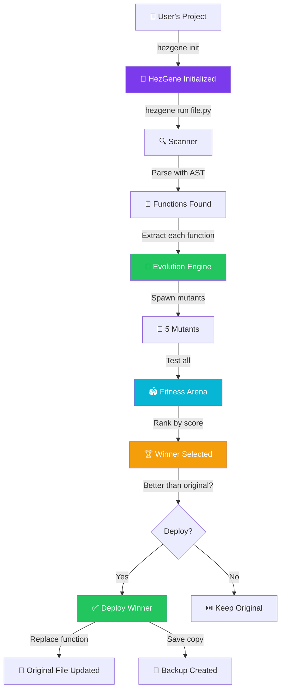
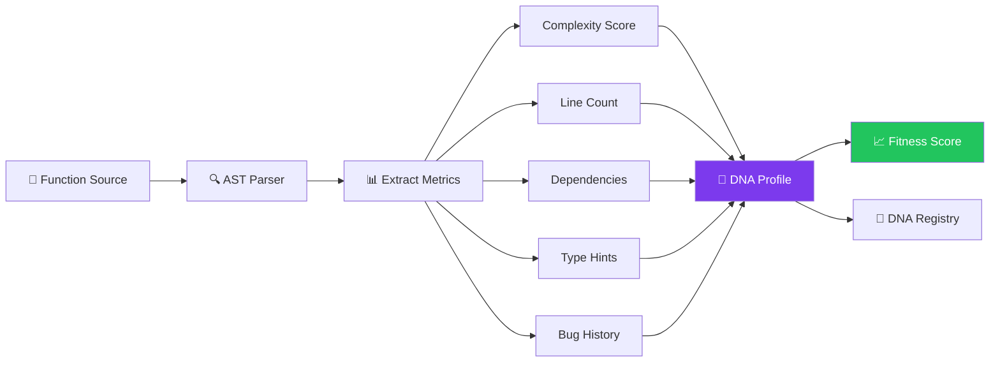
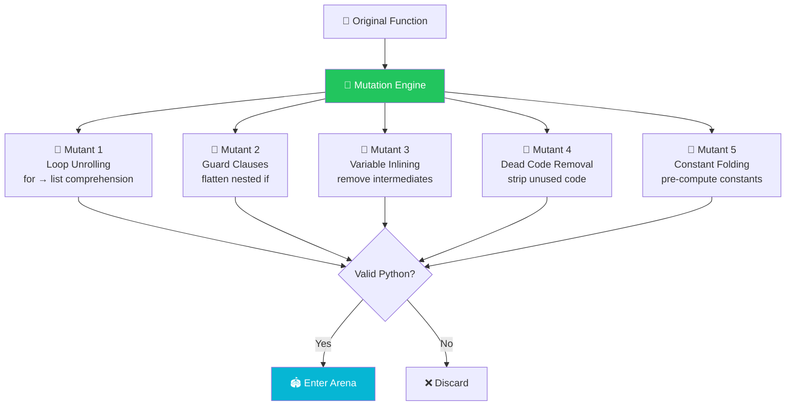
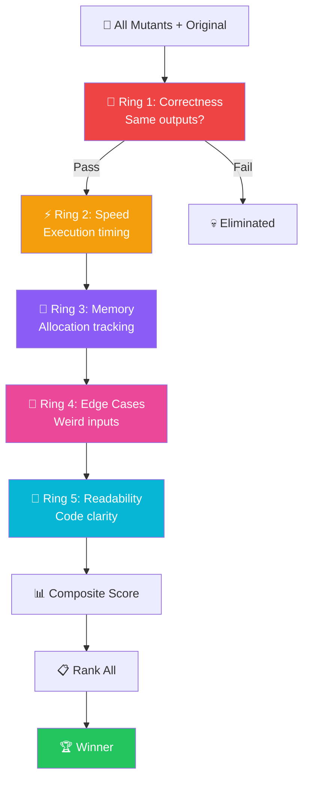

<p align="center">
  
</p>

<h1 align="center">🧬 HezGene Core — The DNA of Software</h1>

<p align="center">
  <strong>The world's first autonomous genetic software evolution platform.</strong><br/>
  Code that writes, optimizes, and heals itself — without human intervention.
</p>

<p align="center">
  <a href="LICENSE"></a>
  <a href="https://www.python.org/downloads/"></a>
  
  
  
</p>

---

## 🔥 The Problem

Software rots. Bugs accumulate. Technical debt kills projects. Humans are terrible at maintaining complex systems over time. Every refactor risks breaking things.

**The radical idea:** What if code wasn't written by humans and then frozen? What if it was **alive**?

## 🧬 The Solution: HezGene Core

HezGene is the **first autonomous genetic software evolution platform**. Every function has DNA — performance metrics, bug history, complexity scores, dependencies. HezGene spawns mutant versions of your functions, tests them in an arena, and deploys the winner automatically. Your code gets better **without you touching it**.

This repository contains the `hezgene-core` engine, licensed under the **Business Source License 1.1** (free for non-commercial use, converts to MIT in 4 years). 

---

## 🏗️ Architecture Overview

### 1. High-Level System Flow

The complete pipeline from initialization to deployed evolution:



---

### 2. DNA Extraction Process

Every function gets a genetic profile — its DNA. This is how HezGene understands your code at a molecular level:



#### The DNA Genes

| Gene | What It Tracks | Weight |
|------|---------------|--------|
| ⚡ **Performance** | Execution speed, memory usage | 30% |
| 🛡️ **Reliability** | Bug count, error history | 30% |
| 📖 **Readability** | Structural complexity, clarity | 20% |
| 🧪 **Coverage** | Test coverage percentage | 15% |
| 📏 **Complexity** | Cyclomatic complexity penalty | 5% |

Functions with poor DNA evolve aggressively. Excellent functions evolve gently. Critical functions can be **frozen**.

---

### 3. Mutation Engine — 6 AST-Based Strategies

The free core engine uses Python's Abstract Syntax Tree to generate intelligent code variants safely and predictably:



#### Mutation Strategies

| # | Strategy | What It Does | Example |
|---|----------|-------------|---------|
| 1 | **Loop → Comprehension** | Converts `for` + `.append()` to list comprehension | `[x for x in items if x > 0]` |
| 2 | **Combine Operations** | Merges multi-step assignments into single expressions | `x = a + b` instead of two lines |
| 3 | **Guard Clause** | Flattens nested `if/else` with early returns | Reduces nesting depth |
| 4 | **Dead Code Removal** | Strips unreachable code after `return`/`raise` | Cleaner function bodies |
| 5 | **Constant Folding** | Pre-computes constant expressions at parse time | `60 * 60` → `3600` |
| 6 | **Early Return** | Adds guard for empty/None inputs | Prevents unnecessary processing |

Every mutant is validated as syntactically correct Python before entering the arena.

---

### 4. Fitness Gauntlet — 5 Rings of Trial

Mutants don't just replace the original. They have to **WIN** through five brutal rings:



#### Ring Details

| Ring | Test | How It Works | Kill Condition |
|------|------|-------------|----------------|
| 🥊 **Correctness** | Output matching | Compiles both functions, runs with test inputs, compares results | Any output mismatch = **eliminated** |
| 🛡️ **Safety** | Infinite loop timeout | Wraps mutant execution in a `ThreadPoolExecutor` | Exceeds 2.0s = **eliminated** |
| ⚡ **Speed** | Execution benchmarks | 100-iteration timing with `perf_counter_ns` | Slower than original = penalty |
| 💾 **Memory** | Allocation tracking | `tracemalloc` peak memory measurement | Higher allocation = penalty |
| 🧪 **Edge Cases** | Weird inputs | Tests with `None`, `0`, `""`, `[]`, `-1` | Crash on edge case = penalty |
| 📖 **Readability** | Structural analysis | AST node density per line | Overly dense code = penalty |

Only mutants that **beat the original's composite score** advance to deployment.

---

## ⚡ Quick Start & Workflow Guide

Follow this precise workflow to use HezGene Core effectively.

### 1. Installation & Initialization
```bash
pip install hezgene-core

# Initialize the DNA Registry and Sandbox in your project
hezgene init
```

### 2. The Evolution Loop (Core Workflow)
To evolve a file, follow this 4-step process:

```bash
# Step 1: Check Baseline DNA
# Measure current speed, memory, and complexity BEFORE making changes.
hezgene dna src/utils.py

# Step 2: Run Evolution
# Spawns mutants, runs the gauntlet, and finds improvements. 
# Safe by default (sandbox only). Use --apply to actually deploy the winner.
hezgene run src/utils.py --apply 

# Step 3: Verify Integrity
# Prove mathematically that the new code behaves identically to the original.
hezgene verify src/utils.py

# Step 4: Check New DNA
# Compare the new DNA scores against your baseline to see the improvements.
hezgene dna src/utils.py
```

---

## 🚀 HezGene Enterprise

Want to take evolution to the next level? **HezGene Enterprise** integrates seamlessly with the core engine to provide premium features for professional teams.

- **🤖 LLM Mutations**: Unlock intelligent, semantic mutations using GPT-4, Claude, Gemini, or local models via Ollama. Evolve logical architecture, not just ASTs.
- **🖥️ Battle Arena UI**: A gorgeous real-time web dashboard to watch your code evolve. View mutant gladiators fight in real-time.
- **♾️ CI/CD Integration**: Automatically evolve code on every Pull Request via GitHub Actions or GitLab CI.
- **👥 Team Management**: Shared evolution configs and license pools.

**[Upgrade to HezGene Enterprise](https://hezgene.ai/pricing)**

---

## 🎯 CLI Commands

```bash
hezgene init                          # Initialize in a project
hezgene scan src/utils.py             # Analyze — show evolvable functions
hezgene run src/utils.py              # Evolve all functions (sandbox mode)
hezgene run src/utils.py:func         # Evolve a specific function
hezgene run --target slowest          # Evolve the slowest function
hezgene run --target buggiest         # Evolve the buggiest function
hezgene run src/utils.py --apply      # Deploy evolved code to source
hezgene verify                        # Verify original vs evolved outputs
hezgene dna src/utils.py:func         # Show function DNA profile
hezgene log                           # Show evolution history
hezgene freeze src/auth.py:verify     # Protect a function from evolution
hezgene unfreeze src/auth.py:verify   # Resume evolution on a function
hezgene clean                         # Clear the sandbox
hezgene clean --all                   # Clear sandbox + DNA registry
hezgene rollback src/utils.py:func    # Revert an applied evolution
```

---

## 🛡️ Safety First

HezGene is designed to be **impossible to misuse**:

- **🧪 Sandbox by default** — `hezgene run` never modifies your original code
- **💾 Automatic backups** — Every deployment creates a timestamped backup
- **✅ Syntax verification** — Deployed code is parsed before writing
- **⏪ Instant rollback** — Any failure automatically restores the original
- **🔒 Freeze protection** — Mark critical functions as un-evolvable
- **🚫 Dunder protection** — `__init__`, `__repr__`, `__eq__` etc. are never touched
- **📏 Size guards** — Functions ≤ 2 lines are too small to optimize

---

## 👨‍💻 Created By

**Hezron Paipai** — System Engineer & AI Architect  
- Creator of **VENOMX** (Sovereign Autonomous Intelligence Engine)
- Full-Stack Developer & Cybersecurity Researcher
- GitHub: [@TechVenom](https://github.com/TechVenom)
- Email: venomx.agent.future@proton.me

---

## 📄 License

**Business Source License 1.1**

HezGene Core is free to use for non-commercial and educational purposes. 

Any commercial use—including incorporating it into a commercial product, offering it as a SaaS, or using it for commercial consulting—requires a paid commercial license. 

To protect the open-source ecosystem, the license automatically converts to the **MIT License** on May 22, 2030 (4 years from the initial release). See the `LICENSE` file for full details.

---

<p align="center">
  <em>"This is our Bitcoin moment. We're not building another app — we're creating a new way software exists."</em>
</p>
