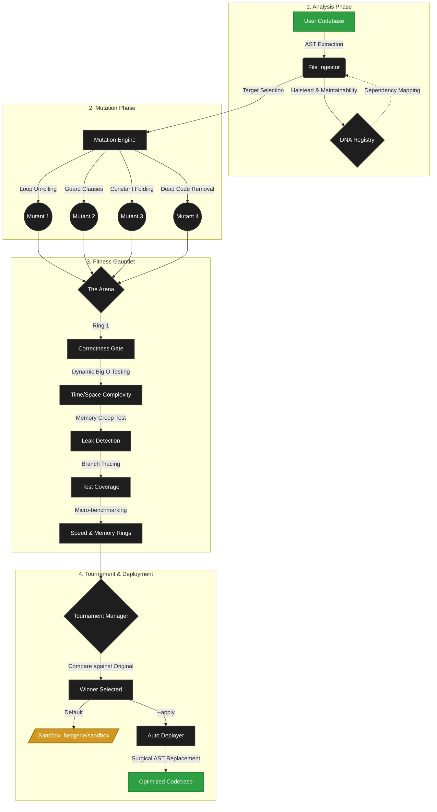

# How It Works (The Architecture of Evolution)

HezGene treats software as a living organism. Instead of static text written once and forgotten, your code is continuously analyzed, mutated, and optimized against rigorous software engineering standards.

## 🏗️ The Evolution Lifecycle

Here is how the autonomous genetic cycle operates:

## 1. The DNA System (Static Analysis & Dependency Graphing)
When HezGene runs, the **File Ingestor** translates your code into an Abstract Syntax Tree (AST). It calculates profound structural metrics instantly:
- **Halstead Complexity Metrics**: Measures the mental effort required to maintain the code by analyzing operators and operands.
- **Maintainability Index**: Computes a standard 0-100 maintainability score.
- **Cyclomatic Complexity**: Maps the density of decision branches.
- **Dependency Graphing**: Builds a comprehensive `Calls` and `Called By` map to determine the function's structural impact.

This DNA is stored persistently in the `.hezgene/dna_registry.json`.

## 2. The Mutation Engine
Once a function is targeted, the **Mutation Engine** spawns multiple "mutant" versions. HezGene utilizes deterministic structural AST transformations:
1. **Loop to Comprehension**: Converts verbose `for` loops with `append()` into highly optimized list comprehensions (runs closer to C-speed).
2. **Guard Clauses**: Flattens deeply nested `if/else` logic into early returns, improving branch prediction.
3. **Dead Code Removal**: Strips out unreachable logic cleanly.
4. **Constant Folding**: Pre-computes mathematical operations or string concatenations at compile-time.

## 3. The Fitness Gauntlet
The spawned mutants face the **Fitness Gauntlet**. Every mutant must survive a rigorous barrage of empirical tests:
1. **Correctness Gate**: The mutant's output is byte-compared against the original code. Any deviation means instant death.
2. **Advanced Scaling Analysis**: HezGene feeds inputs of scaling magnitude ($N=10, 100, 1000$) into the function, mathematically curve-fitting the execution speeds against algorithmic models to determine empirical **Big O Time and Space Complexity**. $O(n^2)$ functions are heavily penalized.
3. **Leak Detection**: The function is executed 1,000 times sequentially. If baseline memory allocation grows consistently, a leak is flagged.
4. **Speed & Memory Rings**: Micro-benchmarking using `time.perf_counter_ns()` determines the absolute nanosecond execution speed.

## 4. The Tournament
Mutants are graded based on their `fitness_score`—a proprietary weighted metric punishing $O(n^2)$ complexity, high Halstead effort, and slow execution times. The **Tournament Manager** matches these scores against the Original baseline. If a mutant performs statistically better without breaking logic, it wins.

## 5. Auto-Deployment (Surgical Replacement)
If you pass the `--apply` flag, the **Auto Deployer** wakes up. Rather than performing dangerous text replacements, it maps the precise physical AST bounds in your file and surgically swaps in the winning mutant's source code, perfectly preserving your global state, imports, and unmodified functions.
